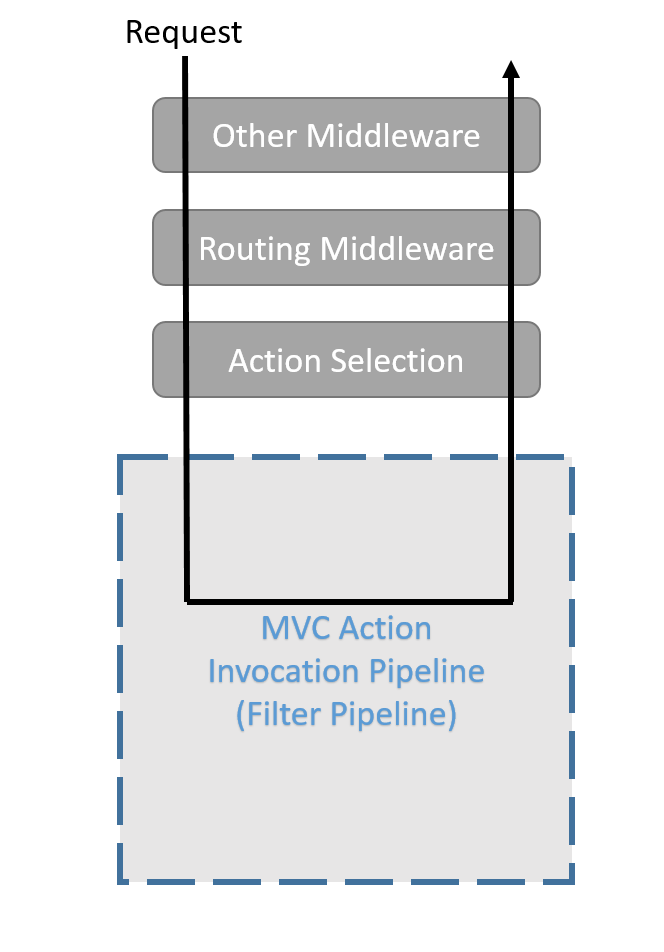
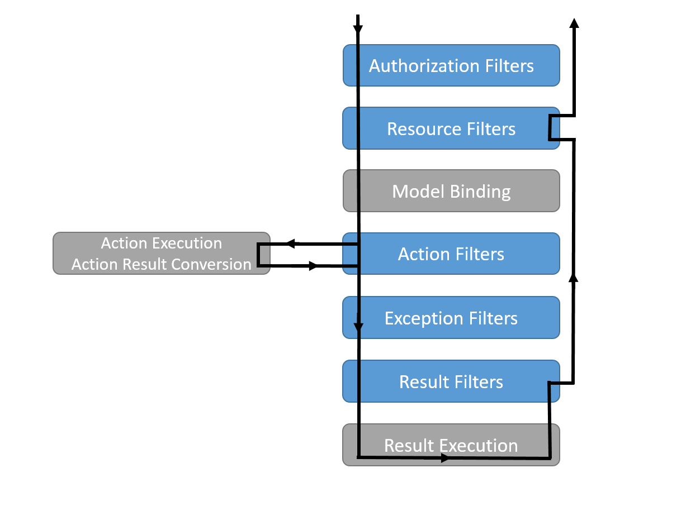

Filters
=======

By `Steve Smith`_

*Filters* in ASP.NET MVC allow you to run code before or after a particular stage in the execution pipeline. Filters can be configured globally, per-controller, or per-action.

.. contents:: Sections
    :local:
    :depth: 1

`View or download sample from GitHub <https://github.com/aspnet/Docs/tree/master/mvc/controllers/filters/sample>`_.

How do filters work?
--------------------

Each kind of filter will be executed at a different stage in the pipeline, and thus has its own set of intended scenarios. Choose what kind of filter to create based on the task you need it to perform, and where in the request pipeline it executes. Filters run within the MVC Action Invocation Pipeline, sometimes referred to as the *Filter Pipeline*, which runs after MVC selects the action to to execute.

Different kinds of filters run at different points within the pipeline. Some filters, like authorization filters, only run before the next stage in the pipeline, and take no action afterward. Other filters, like action filters, can execute both before and after other parts of the pipeline execute, as shown below.

All filters support both synchronous and asynchronous implementations through different interface definitions. Choose the sync or async variant depending on the kind of task you need to perform. They are interchangeable from the framework's perspective.

Synchonous filters define both an On*Stage*Executing and On*Stage*Executed method (with noted exceptions). The On*Stage*Executing method will be called before the event pipeline stage by the Stage name, and the On*Stage*Executed method will be called after the pipeline stage named by the Stage name.

EXAMPLE

Asynchronous filters define a single On*Stage*ExectionAsync method that will surround execution of the pipeline stage named by Stage. The On*Stage*ExectionAsync method is provided a *Stage*ExectionDelegate delegate which will execute the pipeline stage named by Stage when invoked and awaited.

EXAMPLE

In most cases, you can implement both the async and synchronous interfaces at the same time.

Filters and Attributes
^^^^^^^^^^^^^^^^^^^^^^
Most of the time, filter interfaces are applied to *Attributes*. These attributes are used to apply the filter to certain controllers or action methods.

Cancellation and Short Circuiting
^^^^^^^^^^^^^^^^^^^^^^^^^^^^^^^^^
asdf

Configuring Filters
-------------------
How, Where, Ordering, Scope Filters are not directly returned from DI You can write an attribute that has the filter interface on it or you can implement an attribute that implements IFilterFactory or you can use TypeFilter attribute or ServiceFilter attribute TypeFilter: news it up and passes params to its constructor from DI ServiceFilter: gets your filter from ServiceCollection (thus must be registered with DI) If you're using IFilterFactory, you can specify lifetime of the filter When your filter is the instance, your filter instance is cached, so don't do anything stateful. GlobalFilters are registered through MvcOptions
 
Scope
-----
Filter can be applied per-action method (via attribute) or via controller (via attribute), or in global filters collection. Scope also generally determines ordering. The filter closest to the action runs first; generally you get overriding behavior without having to explicitly set ordering.

Authorization Filters
---------------------
*Authorization Filters* control access to action methods, and are the first filters to be executed within the filter pipeline. They are covered in the :doc:`Security </security/index>` section of the documentation.

Learn more about :doc:`/security/authorization/authorization-filters`.

Resource Filters
----------------
*Resource Filters* implement...

Action Filters
--------------
*Action Filters* implement either the ``IActionFilter`` or ``IAsyncActionFilter`` interface and their execution surrounds the execution of action methods. Action filters are ideal for any logic that needs to see the results of model binding, or modify the controller or inputs to an action method. Additionally, action filters can view and directly modify the result of an action method.

As the `OnActionExecuting` method runs before the action method, it can manipulate the inputs to the action by changing `ActionExecutingContext.ActionArguments` or manipulate the controller through `ActionExecutingContext.Controller`. An `OnActionExecuting` method can short-circuit execution of the action method and subsequent action filters by setting `ActionExecutingContext.Result`. Throwing an exception in an `OnActionExecuting` method will also prevent execution of the action method and subsequent filters, but will be treated as a failure instead of successful result.

The `OnActionExecuted` method runs after the action method, and can see and manipulate the results of the action through the `ActionExecutedContext.Result` property. `ActionExecutedContext.Canceled` will be set to true if the action execution was short-circuited by another filter. `ActionExecutedContext.Exception` will be set to a non-null value if the action or a subsequent action filter threw an exception. Setting `ActionExecutedContext.Exception` to null effectively 'handles' an exception, and `ActionExectedContext.Result` will be executed as if it were returned from the action method normally.

For an `IAsyncActionFilter` the `OnActionExecutionAsync` combines all the possibilites of `OnActionExecuting` and `OnActionExecuted`. A call to `await next()` on the `ActionExecutionDelegate` will execute any subsequent action filters and the action method, returning an `ActionExecutedContext`. To short-circuit inside of an `OnActionExecutionAsync`, set `ActionExecutingContext.Result` and do not call the `ActionExectionDelegate`.

Exception Filters
-----------------
*Exception Filters* implement...

Exception filters handle unhandled exceptions. They are only called when an exception occurs later in the pipeline. They can provide a single location to implement common error handling policies within an app. 

Result Filters
--------------
*Result Filters* implement either the ``IResultFilter`` or ``IAsyncResultFilter`` interface and their execution surrounds the execution of action results. Result filters are only executed for successful results - when the action or action filters produces an action result. Result filters are not executed when exception filters handle an exception.

Result filters are ideal for any logic that needs to directly surround view execution or formatter execution. Result filters can replace or modify the action result that's responsible for producing the response.

As the `OnResultExecuting` method runs before the action action, it can manipulate the action result through `ResultExecutingContext.Result`. An `OnResultExecuting` method can short-circuit execution of the action result and subsequent result filters by setting `ResultExecutingContext.Cancel` to true. If short-circuited, MVC will not modify the response; take care to write to the response object directly when short-circuiting. Throwing an exception in an `OnResultExecuting` method will also prevent execution of the action result and subsequent filters, but will be treated as a failure instead of successful result.

The `OnResultExecuted` method runs after the action action, at this point if no exception was thrown, the response has likely be sent to the client and cannot be changed further. `ResultExecutedContext.Canceled` will be set to true if the action result execution was short-circuited by another filter. `ResultExecutedContext.Exception` will be set to a non-null value if the action result or a subsequent result filter threw an exception. Setting `ResultExecutedContext.Exception` to null effectively 'handles' an exception and will prevent the exeception from being rethrown by MVC later in the pipeline. If handling an exception in a result filter, consider whether or not it's appropriate to write any data to the response. The action result may have thrown partway through its execution, and if the headers have already been flushed to the client there's no proper recourse to send a failure status code. 

For an `IAsyncResultFilter` the `OnResultExecutionAsync` combines all the possibilites of `OnAResultExecuting` and `OnResultExecuted`. A call to `await next()` on the `ResultExecutionDelegate` will execute any subsequent result filters and the action result, returning a `ResultExecutedContext`. To short-circuit inside of an `OnResultExecutionAsync`, set `ResultExecutingContext.Cancel` to true and do not call the `ResultExectionDelegate`.

Filters vs. Middleware
----------------------

